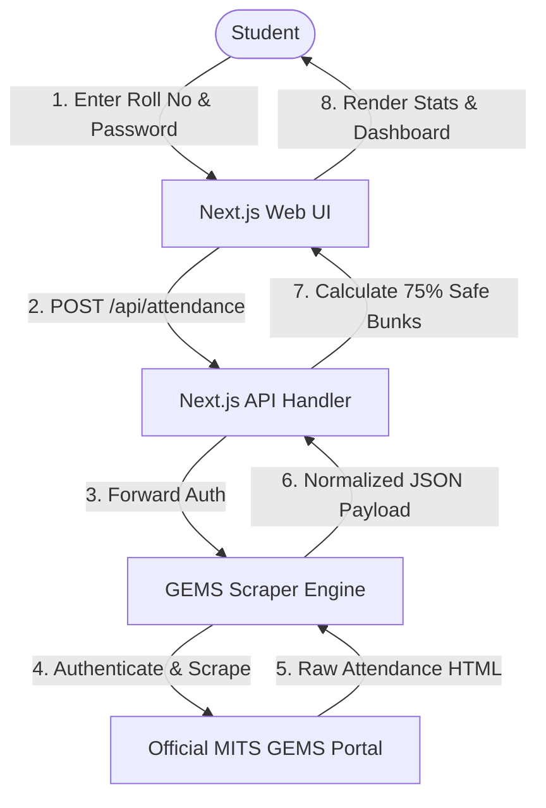

# MITS Attendance Tracker - Architecture & Data Flow

## Overview
MITS Attendance Tracker connects students of Madanapalle Institute of Technology & Science directly to their live GEMS attendance records.

## Calculation Logic
- **Exact Subject Percentage**: `(Attended / Conducted) * 100`
- **Safe Bunks**: `floor((Attended / 0.75) - Conducted)`
- **Mandatory Classes Required**: `ceil((0.75 * Conducted - Attended) / (1 - 0.75))`
